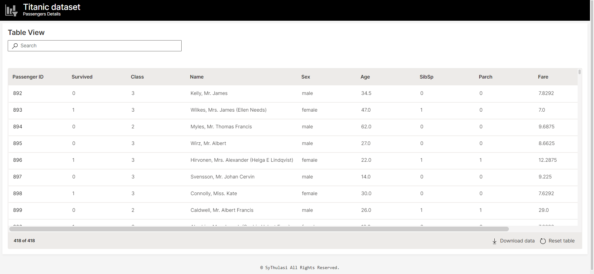

# Passenger Details Dashboard

The Passenger Details Dashboard is a web application Using H2O Wave that provides a user-friendly interface for viewing and managing passenger information. It allows users to access and display various details of passengers, facilitating efficient management and analysis of passenger data.

## Features

- View a list of passengers along with their relevant details.
- Search and filter passengers based on criteria such as name, age, gender, etc.

## Technologies Used

- [H2O Wave](https://wave.h2o.ai/): A Python library for developing and deploying interactive web applications.

## Prerequisites

- Python 3.x
- H2O Wave (installation instructions can be found on the [H2O Wave website](https://wave.h2o.ai/))

## Installation

1. Clone the repository: `git clone https://github.com/your-username/passenger-details-dashboard.git`
2. Install the required Python packages: `pip install -r requirements.txt`

## Usage

1. Start the H2O Wave server: `wave run app.py`
2. Open your web browser and visit `http://localhost:10101` to access the Passenger Details Dashboard.

## Development

- The main application logic can be found in the `app.py` file.
- Additional customization and styling can be done in the `app.ui` module.

